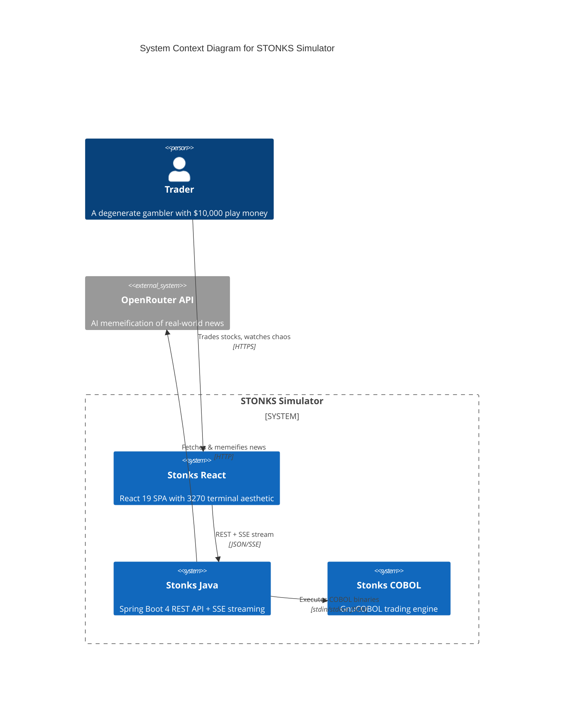
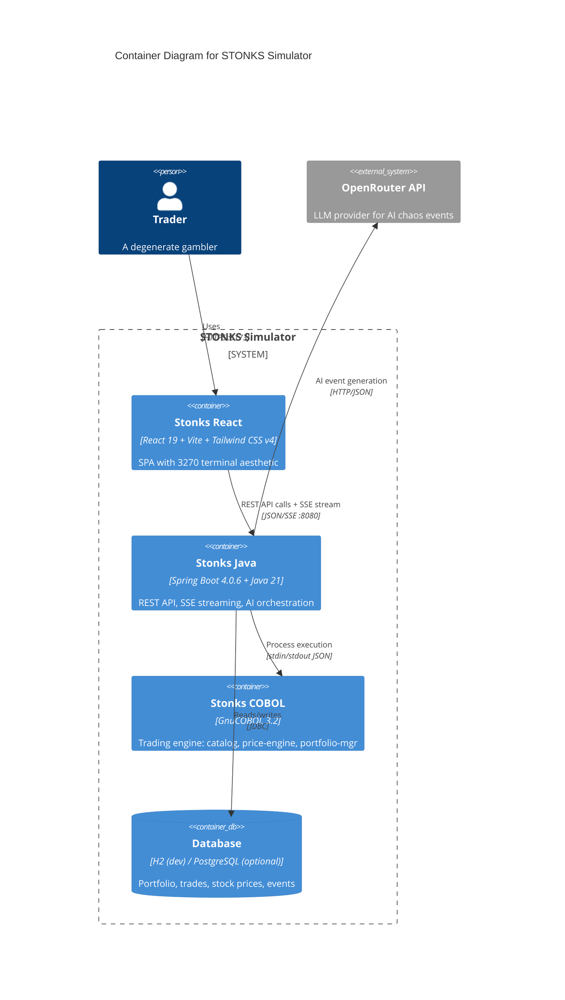
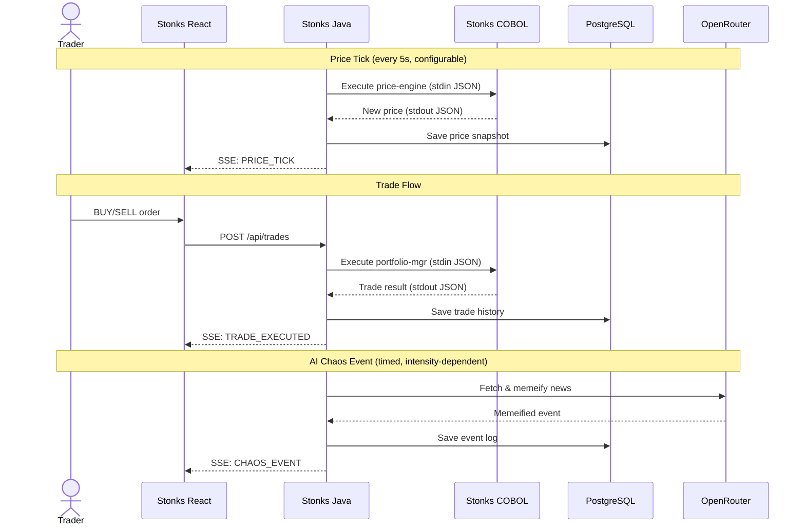

# STONKS Simulator


> *"This is such a delightfully terrible idea!"*
~ Kimi K2.6 when told we are building this project

A chaotic meme stock trading simulator that bridges 1959 COBOL technology with modern Java Spring Boot and React. Features AI-powered real-world events memeified into market chaos, all wrapped in a retro 3270 terminal aesthetic. Built as a portfolio piece demonstrating the absurdity of connecting 60+ years of computing technology.

## Screenshots


### Game Over States

| Wiped Out | To The Moon |
|-----------|-------------|
|  |  |

## Architecture

### C4 Level 1: System Context



### C4 Level 2: Container View



### Data Flow



## Features

### Core Trading

- **$10,000 play money** starting balance with configurable win/loss thresholds
- **10 meme stocks** with unique behaviors and trends
- **Real-time price updates** via SSE streaming with configurable tick interval
- **Portfolio tracking** with P&L calculations, unrealized gains/losses
- **Buy/Sell orders** validated by the COBOL `portfolio-mgr` engine
- **Game over states**: BANKRUPT when portfolio drops below $1,000, MOON ACHIEVED at $100,000

### The Chaos System

- **5 intensity levels** from PAPER_HANDS to MAXIMUM_OVERDRIVE
- **AI-powered market events** generated via OpenRouter (LLM) based on real-world news headlines
- **Fallback events** when AI is unreachable
- Event-driven price swings broadcast in real-time via SSE

### Intensity Levels

| Level | Name | Volatility Multiplier | AI Event Interval |
|-------|------|-----------------------|-------------------|
| 1 | **PAPER_HANDS** | 1.0x | 15 min |
| 2 | **MODERATE** | 2.0x | 5 min |
| 3 | **HIGH_VOLATILITY** | 5.0x | 2 min |
| 4 | **EXTREME** | 12.5x | 1 min |
| 5 | **MAXIMUM_OVERDRIVE** | 25.0x | 30s |

### Retro Experience

- **3270 terminal emulator** UI with green phosphor CRT aesthetic
- **Retro landing page** with ASCII art banner and fake boot sequence
- **Scanlines overlay** across all screens
- **JetBrains Mono** font throughout

### SSE Event Types

| Event | Payload | Trigger |
|-------|---------|---------|
| `PRICE_TICK` | `symbol`, `price`, `timestamp` | Every tick interval |
| `TRADE_EXECUTED` | Trade result | After buy/sell order processed |
| `CHAOS_EVENT` | Memeified event | When AI generates an event |
| `SPEED_CONFIG` | `tickIntervalMs`, `intensityLevel`, `volatilityMultiplier`, `aiEventIntervalMs` | On connect + intensity change |
| `GAME_CONFIG` | Win/lose thresholds, initial cash | On connect |
| `GAME_WON` | — | Portfolio hits win threshold |
| `GAME_LOST` | — | Portfolio drops to lose threshold |
| `GAME_RESET` | — | User clicks "PLAY AGAIN" |

### The Meme Stocks

| Symbol | Name | Description | Trend |
|--------|------|-------------|-------|
| **COBL** | COBOL Corp | Legacy systems never die | BULL |
| **GMEE** | GameStonks | To the moon! | MOON |
| **DOGE** | DogeCoin Ltd | Much profit, very wow | CHAOS |
| **TEND** | Tendie Inc | WSB favorite | BEAR |
| **FOMO** | FOMO Holdings | Buy high, sell higher | BULL |
| **PAPR** | Paper Hands | For the weak | BEAR |
| **YOLO** | YOLO Capital | You only live once | CHAOS |
| **MEME** | MemeStonks | Viral potential | MOON |
| **BUGS** | Buggy Software | It compiles, ship it! | CHAOS |
| **JAVA** | JavaBeans | Write once, run anywhere | BULL |

### AI Event Pipeline

```
Real World News (RSS)
      ↓
News Module — fetches current headlines
      ↓
Chaosevent Module — builds prompt with headlines + stock catalog
      ↓
OpenRouter API (LLM)
      ↓
JSON response: { symbol, headline, impact, explanation, affectedStocks }
      ↓
Fallback adapter (template-based) if AI fails
      ↓
SSE Broadcast → CHAOS_EVENT
      ↓
Stock prices impacted by event severity
```

### COBOL Trading Engine

Three GnuCOBOL programs communicate with the Java backend via stdin/stdout JSON:

| Program | Lines | Purpose |
|---------|-------|---------|
| `catalog` | 148 | Source-of-truth catalog of 10 meme stocks |
| `price-engine` | 153 | Random walk price simulation with trend bias and circuit breakers |
| `portfolio-mgr` | 303 | Trade validation and execution with fee calculation |

## Project Structure

```
stonks-simulator/
├── README.md
├── assets/                 # Screenshots and images
├── stonks_java/            # Spring Boot 4 backend (see stonks_java/README.md)
├── stonks_cobol/           # GnuCOBOL trading engine (catalog, price-engine, portfolio-mgr)
├── stonks_vite_app/        # React 19 + Vite + Tailwind CSS v4 frontend
└── .opencode/              # OpenCode agent configuration and skills
```

## Tech Stack

| Layer | Technology | Version |
|-------|-----------|---------|
| Frontend | React + TypeScript | 19 / 5.9 |
| Build | Vite | 7 |
| CSS | Tailwind CSS | 4 |
| UI Components | shadcn/ui (Radix) | Nova |
| Charts | Recharts | 3 |
| Data Fetching | TanStack React Query | 5 |
| Diagrams | @xyflow/react (ReactFlow) | 12 |
| API Client | Orval (OpenAPI codegen) | 7 |
| Backend | Spring Boot + Java | 4.0.6 / 21 |
| Build | Gradle | 8 |
| Architecture | Hexagonal + Modulith | — |
| COBOL | GnuCOBOL | 3.2 |
| Database | H2 (dev) / PostgreSQL (optional) | — |
| AI | OpenRouter API | — |
| Observability | OpenTelemetry (optional) | — |

## Running Locally

### Prerequisites

- Java 21
- GnuCOBOL 3.2+ (for real COBOL mode; stubs work without it)
- Node.js 22+

### Backend

```sh
cd stonks_java
./gradlew bootRun                                    # H2 + all stubs (zero deps)
./gradlew bootRun --args='--stonks.adapters.cobol=real --stonks.adapters.ai=real --stonks.adapters.news=real'  # All real backends
```

### COBOL Programs

```sh
cd stonks_cobol
make                    # Compile all programs to bin/
make test               # Run test suite (12 tests across 3 programs)
```

### Frontend

```sh
cd stonks_vite_app
pnpm install
pnpm run dev             # Vite dev server on :5173, proxies API to :8080
```

The full stack runs at `http://localhost:5173`.

## Project Status

This is a **portfolio piece and learning project** — not production software. I built it to explore COBOL integration, hexagonal architecture, SSE streaming, and retro UI design. It is functionally complete for single-player local use, but I have no plans to take it further.

### What was left undone

- **Dockerization** — no Dockerfiles or docker-compose; everything runs locally
- **Deployment** — no production environment; Coolify/OCI plans were shelved
- **Observability** — OpenTelemetry export is coded but untested end-to-end
- **Authentication** — single anonymous user only; no login system
- **Multiplayer / leaderboards** — out of scope from the start
- **Real stock APIs** — AI events use RSS headlines for context, not real-time market data APIs

## Credits

Built with ♡ and an unhealthy appreciation for legacy systems by [Franco Becvort](https://www.linkedin.com/in/franco-becvort)

```
╔═══════════════════════════════════════════════════════════╗
║  STONKS-SIMULATOR v1.0 - COPYRIGHT 1959-2026 POLLITO.DEV  ║
║  Y2K COMPLIANT ✓  |  SYSTEM SECURE ✓  |  HAVE A NICE DAY  ║
╚═══════════════════════════════════════════════════════════╝
```
