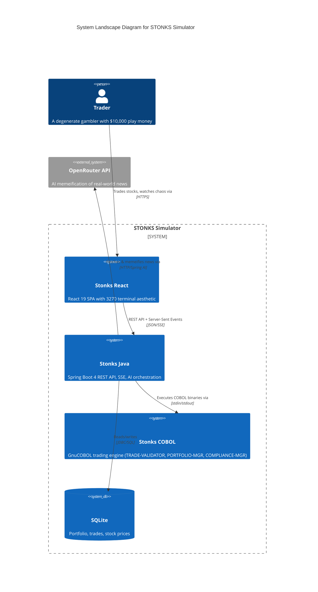

# STONKS Simulator


_This is a work in progress. During development, tech choices might change_

A chaotic meme stock trading simulator that bridges 1959 COBOL technology with modern Java Spring Boot and React. Features AI-powered real-world events memeified into market chaos, all wrapped in a retro 3270 terminal aesthetic. Built as a portfolio piece demonstrating the absurdity of connecting 60+ years of computing technology.

Users can experience hilarious, chaotic fake stock trading with real-time price updates, buy/sell orders, and AI-driven market events — all through an authentic retro terminal interface powered by actual COBOL trading logic.

This exists because:

1. COBOL still runs the world's financial systems
2. Meme stocks exist
3. AI can make anything funnier
4. Why not?

## Desired Features

### AI mock UIs


### Core Trading

- **$10,000 play money** starting balance
- **10 meme stocks** with unique behaviors and trends
- **Real-time price updates** (speed adjustable)
- **Portfolio tracking** with P&L calculations
- **Buy/Sell orders** with "manager approval" for large trades

### The Chaos System

- **5 chaos levels** from "Paper Hands" to "MAXIMUM OVERDRIVE"
- **AI-powered market events** based on real-world news
- **Random volatility** and market crashes
- **Event-driven price swings** (+500% to -90%)

### Retro Experience

- **3270 terminal emulator** UI
- Green phosphor CRT** aesthetic
- **Paper tape printer** output for every trade
- **COBOL-style error messages** ("JOB ABEND S222 - INSUFFICIENT FUNDS")

###  The Meme Stocks

| Symbol   | Name           | Description              | Trend Behavior                  |
|----------|----------------|--------------------------|---------------------------------|
| **COBL** | COBOL Corp     | Legacy systems never die | Slow, steady growth             |
| **GMEE** | GameStonks     | To the moon! 🚀          | High volatility, meme pumps     |
| **DOGE** | DogeCoin Ltd   | Much profit, very wow    | Random spikes, Elon-sensitive   |
| **TEND** | Tendie Inc     | WSB favorite             | Inverse market correlations     |
| **FOMO** | FOMO Holdings  | Buy high, sell higher    | Momentum-driven                 |
| **PAPR** | Paper Hands    | For the weak             | Generally declining             |
| **YOLO** | YOLO Capital   | You only live once       | Extreme chaos mode              |
| **MEME** | MemeStonks     | Viral potential          | Event-driven explosions         |
| **BUGS** | Buggy Software | It compiles, ship it!    | Frequent crashes, then recovery |
| **JAVA** | JavaBeans      | Write once, run anywhere | Stable, enterprise boring       |

### Stock Properties

Each stock has:
- **Base price** - Starting value ($10-$150)
- **Volatility** - How much it swings (1%-50%)
- **Trend** - Long-term direction (bull/bear/sideways)
- **AI keywords** - Words that trigger events (e.g., "Elon" → DOGE)

### Chaos Levels and Effects

Control the madness with 5 chaos levels:

| Level | Name                  | Price Update | Volatility | AI Events | Description          |
|-------|-----------------------|--------------|------------|-----------|----------------------|
| 1     | **Paper Hands**       | 30s          | ±2%        | 10 min    | Training wheels mode |
| 2     | **Casual**            | 10s          | ±5%        | 5 min     | Normal trading       |
| 3     | **Degenerate**        | 5s           | ±10%       | 2 min     | Getting spicy        |
| 4     | **YOLO**              | 2s           | ±25%       | 30s       | Pure adrenaline      |
| 5     | **MAXIMUM OVERDRIVE** | 1s           | ±50%       | 10s       | Financial chaos      |

- **Price volatility** - Random walk with trend bias
- **Market events** - AI-generated news impacting stocks
- **Flash crashes** - Sudden -50% drops (rare, exciting)
- **Moon shots** - Sudden +500% pumps (even rarer)
- **Circuit breakers** - Trading halts after extreme moves

### AI-Powered Events

#### How It Works

1. **Scheduler runs** every X minutes (based on chaos level)
2. **Fetches real events** via Spring AI + OpenRouter
3. **Memeifies** the event into stock market chaos
4. **Broadcasts** to all connected clients via SSE
5. **Applies effects** to relevant stocks

#### Event Pipeline

```
Real World News
      ↓
[Spring AI] → "What's happening in tech/finance?"
      ↓
OpenRouter API
      ↓
Memeification Prompt
      ↓
{
  "symbol": "DOGE",
  "headline": "ELON TWEETED ABOUT DOGS",
  "impact": 250,
  "explanation": "MUCH WOW, VERY PROFIT 🐕"
}
      ↓
Broadcast to Frontend
      ↓
DOGE +250% INSTANTLY
```

#### Example Events

**Real Event:** Elon Musk tweets about Mars colonization
**AI Memeified:**
```json
{
  "symbol": "GMEE",
  "headline": "ELON MENTIONS 'GAME' IN TWEET",
  "impact": 180,
  "explanation": "CLEARLY ABOUT GAMESTOP. TO THE MOON! 🚀",
  "affectedStocks": ["GMEE", "DOGE"]
}
```

**Real Event:** Fed raises interest rates
**AI Memeified:**
```json
{
  "symbol": "PAPR",
  "headline": "RATE HIKE = PAPER HANDS SELLING",
  "impact": -40,
  "explanation": "EVERYONE PANIC SELLING EXCEPT DIAMOND HANDS 💎🙌",
  "affectedStocks": ["PAPR", "FOMO", "YOLO"]
}
```

#### Fallback Events

When AI is unavailable, use pre-made chaos:

- "COBOL PROGRAMMER RETIRED" → COBL +50%
- "BUG FOUND IN PRODUCTION" → BUGS -40%
- "WSB DISCOVERS STOCK" → Random pump
- "MARKET CRASH" → All stocks -20%

## Out of Scope Requirements

### Not now, but would like to do in the future

- Multiplayer/leaderboard (implies an auth system too)

### Definitely not

- Real money trading — This is a simulator with play money only
- Real stock data APIs (Twelve Data) — AI "memefied" events based on real life are primary
- Mobile app — Web-only

## Tech Constraints

- **Tech stack**: Java 21, Spring Boot 4.0.6, GnuCOBOL 3.2, React 19, Tailwind CSS v4, SQLite — fixed by project concept
- **Environment**: Local development in my NixOS with BusyBox PC; Production environment should be a docker compose Coolify project
- **Budget**: Free tier APIs where possible
- **Timeline**: Portfolio piece, no timeline whatsoever

### Key Decisions

| Decision                                    | Rationale                                                                            | Outcome   |
|---------------------------------------------|--------------------------------------------------------------------------------------|-----------|
| Java 21 + Spring Boot 4.0.6                 | Proven LTS with virtual threads; current stable Initializr default                   | — Pending |
| Spring Web MVC over WebFlux                 | Blocking I/O (SQLite, COBOL processes) fits MVC; SseEmitter sufficient for streaming | — Pending |
| React 19 + Tailwind CSS v4                  | Latest stable versions; v4 performance improvements fit retro UI needs               | — Pending |
| GnuCOBOL + process execution instead of JNI | Simpler integration, authentic binary execution feel, easier debugging               | — Pending |
| SQLite over traditional RDBMS               | Zero-config, embedded, fits the lightweight/portable nature                          | — Pending |
| OpenRouter API for AI events                | Free tier available, multiple model options, Spring AI compatible                    | — Pending |
| Retro terminal aesthetic (3270)             | Core differentiator and portfolio wow-factor                                         | — Pending |
| Single anonymous user                       | Simpler scope, focus on trading mechanics not auth                                   | — Pending |

### System Landscape Diagram



### Project Structure

```
stonks-simulator/
├── README.md           # This file
├── docker-compose.yml	# Coolify compatible production deployment
├── stonks_java/        # Java Spring Boot App
├── stonks_cobol/       # COBOL Trading Engine
├── stonks_vite_app/    # React Vite SPA
└── database/           # Database artifacts
```

## TO-DO List

- [ ] Core Spring Boot backend with REST API and SQLite database
- [ ] COBOL trading engine (`TRADE-VALIDATOR`, `PORTFOLIO-MGR`, `COMPLIANCE-MGR`)
- [ ] Java ↔ COBOL process execution integration
- [ ] Real-time stock price simulation with configurable chaos levels
- [ ] React frontend with 3270 terminal aesthetic
- [ ] AI-powered chaos events via OpenRouter integration
- [ ] Paper tape transaction logging and retro error messages
- [ ] Buy/sell order flow with "manager approval" for large trades
- [ ] Portfolio tracking with P&L calculations

## Credits

Built with ♡ and an unhealthy appreciation for legacy systems by [Franco Becvort](https://www.linkedin.com/in/franco-becvort)

```
╔═══════════════════════════════════════════════════════════╗
║  STONKS-SIMULATOR v1.0 - COPYRIGHT 1959-2026 POLLITO.DEV  ║
║  Y2K COMPLIANT ✓  |  SYSTEM SECURE ✓  |  HAVE A NICE DAY  ║
╚═══════════════════════════════════════════════════════════╝
```