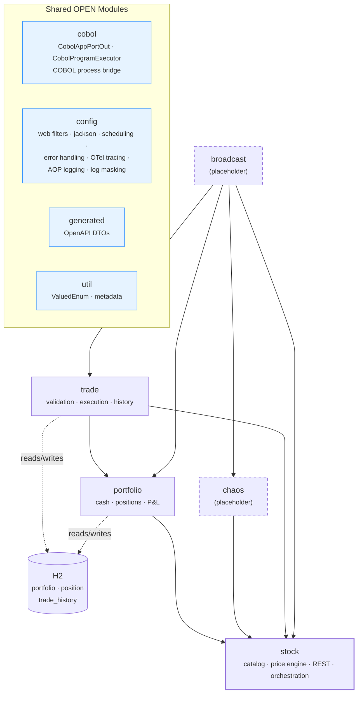
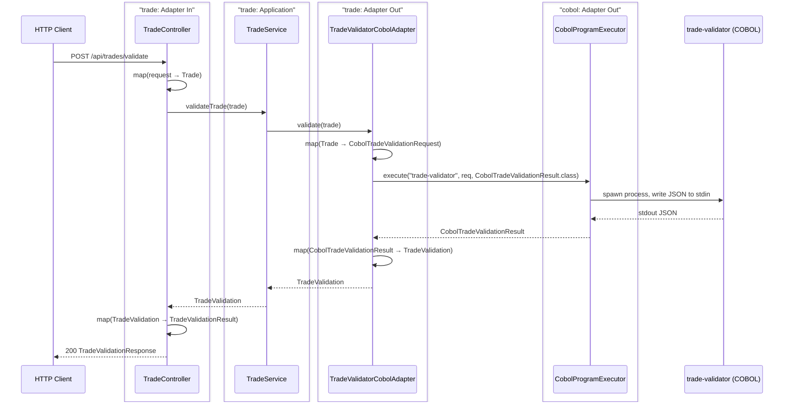
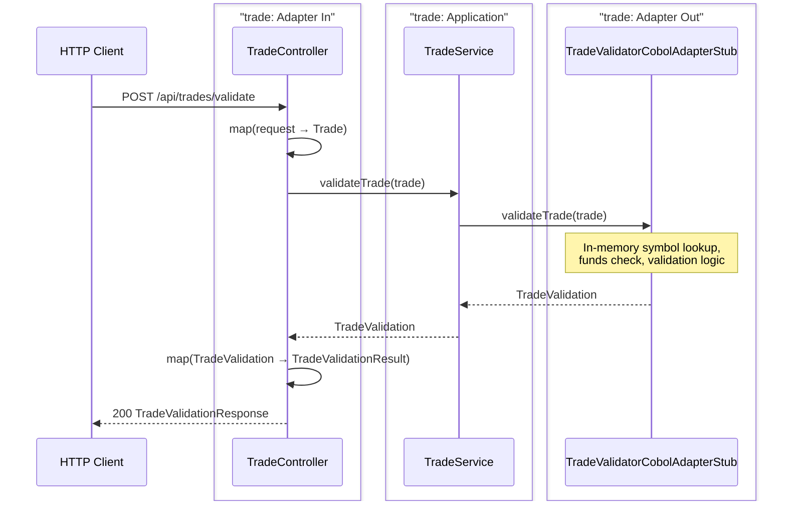
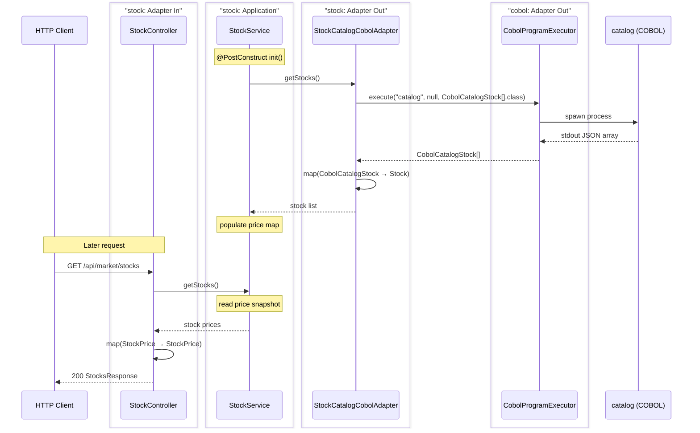
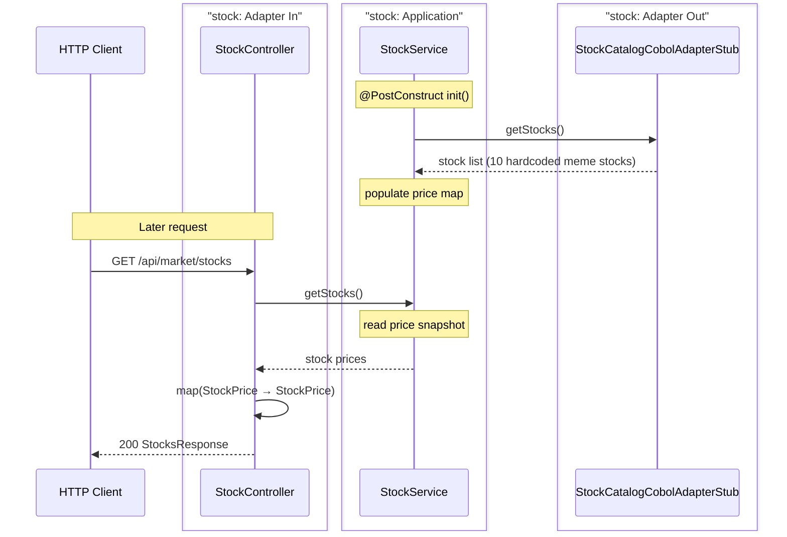
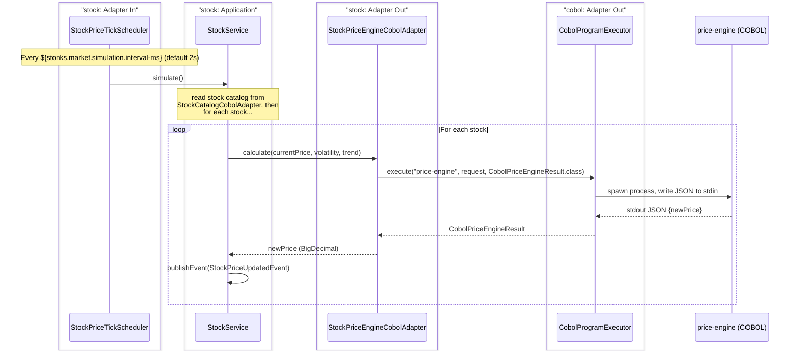
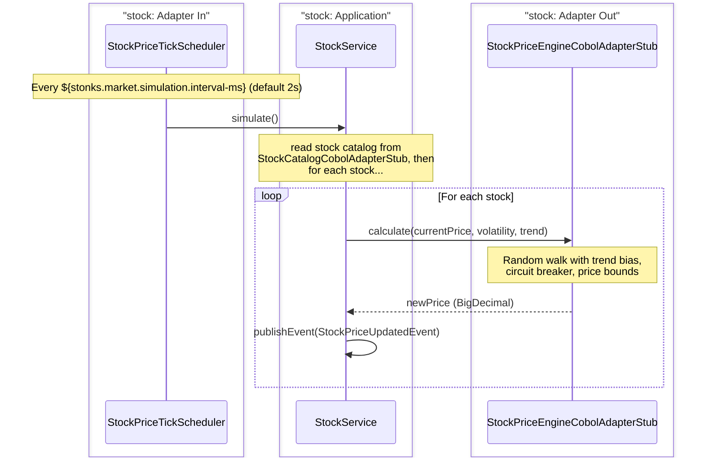
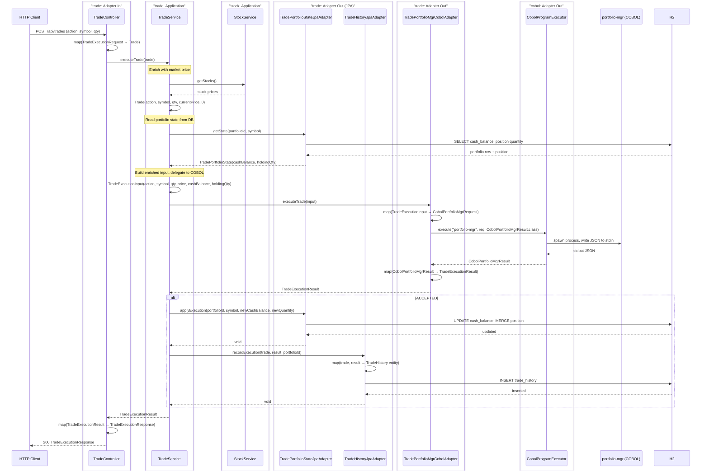
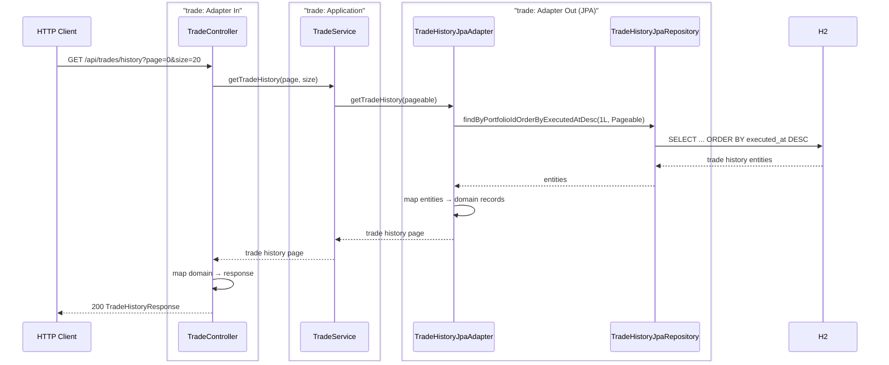

# stonks_java — Spring Boot Backend

Orchestrates the stonks-simulator: exposes REST APIs, runs the market simulation loop, and bridges requests to COBOL programs via **stdin/stdout JSON over OS process execution**.

## Environments

Three runtime profiles control which dependencies are active:

| Profile | DB | COBOL | OTel | Use case |
|---------|----|-------|------|----------|
| *(none)* | H2 (embedded) | Stubs (Java in-memory) | Disabled | Default for local dev & `./gradlew test` |
| `cobol` | H2 (embedded) | Real COBOL process execution | Disabled | Manual testing with COBOL setup |
| `production` | PostgreSQL | Real COBOL process execution | Enabled | Production/staging (*PG driver not yet in build.gradle*) |

- **`./gradlew bootRun`** — starts with H2 + stubs, no external dependencies needed.
- **`./gradlew bootRun --spring.profiles.active=cobol`** — starts with H2 + real COBOL binaries.
- **`./gradlew test`** — runs against H2 + stubs. CI-ready, zero config.
- **VS Code** — three launch configs in `.vscode/launch.json`: `[local]`, `[cobol]`, `[production]`.

### How it works

- `application.yaml` (always loaded) provides H2 datasource + disables OTel by default.
- COBOL stub adapters are annotated with `@Profile("!cobol & !production")` — active in any profile except `cobol` or `production`.
- Real COBOL adapters are annotated with `@Profile({"cobol", "production"})` — only active when one of those profiles is set.
- `application-production.yaml` overrides the datasource to PostgreSQL and enables OTel.

---

## Hexagonal Architecture: Pragmatic Modulith Approach

### Module Architecture Graph



### Core rule

The application core (`application/`) imports only:
- **Domain records** (`domain/`) — plain Java, zero framework coupling
- **Port interfaces** (`application/port/in/`, `application/port/out/`) — contracts, not implementations

Everything else (JPA entities, repositories, REST serialization, COBOL process bridges, MapStruct mappers) lives in the **adapter layer** (`adapter/in/`, `adapter/out/`). The core never sees infrastructure types.

### Why this shape

This is a **modulith** — a single deployable with strict module boundaries. Not microservices. The architecture optimizes for:

| Concern | Choice | Why |
|---------|--------|-----|
| Transaction boundary | `@Transactional` on the **service** (not the adapter) | The unit of work is a business operation (update portfolio + position + history atomically), not an infrastructure detail. Adapters participate via propagation. |
| Port granularity | Consolidate related CRUD behind one port | Avoid "one port per table" syndrome. `TradePortfolioStatePortOut` covers read + write of portfolio + position because they always change together. |
| Entity relationships | Adapters own entity lifecycle internally | The `TradeHistory` → `Portfolio` FK is resolved inside the adapter, not the core. Hibernate's first-level cache prevents redundant queries within the same transaction. |
| Profile segregation | Stub adapters active by default (`!cobol & !production`) | Local dev and CI need zero external dependencies. Real adapters activate only when the environment provides them. |

### Where is ok to relax purity

A purist hexagonal architecture demands **one port per driven concern** and forbids any framework annotation in the core. We relax both selectively wherever purity would add ceremony without clarity:

- **Framework annotations in the core** — `@Transactional`, `@PostConstruct`, Spring scheduling annotations, and similar go on the service layer when they express a *business concern* (e.g. "this operation must be atomic", "the catalog must be loaded at startup") rather than a technical implementation detail. The rule: if the annotation describes *what* the system does, it belongs in the core; if it describes *how* (e.g. specific connection pool settings), it belongs in an adapter.

- **Framework types in the core** — Stable framework types (`Page`, `Pageable`) appear in service classes, port interfaces, or anywhere in the application layer when a hand-rolled equivalent would add zero semantic value. The test is: would a custom wrapper tell a future reader something they wouldn't get from the original type? If no, we keep the framework type and document the dependency boundary.

- **Direct injection of stable Spring framework classes** — Well-defined, stable Spring interfaces like `ApplicationEventPublisher` may be injected directly into services without a port wrapper. The test is the same as for framework types: would a custom port interface add semantic clarity, or just add indirection? If the framework interface already expresses the business intent clearly, we inject directly and document the dependency boundary.

- **Consolidated ports over fine-grained ones** — Ports group related read + write operations that always change together within the same transaction boundary. This avoids the indirection of "one method per operation" ports while keeping the core decoupled from any specific persistence technology.

### What goes in the adapter layer

Every module follows the same split: the **application core** (`application/`) holds only business logic expressed as service classes that depend exclusively on domain records and port interfaces. The **adapter layer** (`adapter/in/`, `adapter/out/`) owns everything that touches infrastructure:

- **`adapter/in/`** — REST controllers, scheduled task runners, SSE publishers. These translate external protocol (HTTP requests, scheduling ticks) into core service calls and map responses back to transport DTOs.
- **`adapter/out/`** — JPA repository adapters (entity mapping, query execution), COBOL process adapters (serialization, process spawning, deserialization), and their stub counterparts used in development profiles. Each adapter implements a port interface from the core and translates between domain records and infrastructure-specific types (entities, COBOL JSON DTOs, etc.).

The core never imports a JPA entity, a MapStruct mapper, a REST DTO, or a COBOL bridge class. Those live in the adapters, swapped by Spring's profile mechanism: stubs are active by default (`!cobol & !production`), real implementations activate only when their environment is configured.

Additional considerations for the adapter layer:

- **Stub adapters may contain business logic** — Stubs approximate the real COBOL programs for local dev and CI. They necessarily encode domain rules (validation, pricing, execution math) so the system works end-to-end without external dependencies. These rules are *approximations* and may drift from the COBOL canonical logic. Treat stubs as dev-time stand-ins, not as source of truth for business rules.

- **Inline mapping vs. dedicated mappers** — Adapters may map directly between infrastructure types and domain records inline when the conversion is trivial (a handful of field assignments). A dedicated MapStruct mapper is preferred when the mapping is non-trivial, shared across multiple methods, or would clutter the adapter's readability. Consistency within a module matters more than consistency across modules.

- **Placeholders for values enriched later** — Adapters should avoid making domain decisions, but returning placeholder values (e.g. `BigDecimal.ZERO`) for fields the adapter cannot populate — because the data source doesn't carry them yet — is a valid workaround. The service layer enriches these values before they reach the caller. The rule: an adapter may return an incomplete record when it *genuinely doesn't have the data*, not when it's *choosing a domain default*.

### Naming Convention

All classes follow the formula: `{Module}{Concept}{Layer}[Technology]`

| Part | Meaning | Examples |
|------|---------|----------|
| `Module` | Spring Modulith module the class belongs to | `Stock`, `Trade`, `Portfolio` |
| `Concept` | What the class does (omit when unambiguous) | `Catalog`, `PriceEngine`, `Validator`, `History` |
| `Layer` | Hexagonal/architectural role | `PortIn`, `PortOut`, `Controller`, `Service`, `Adapter`, `Mapper`, `Repository` |
| `[Technology]` | Implementation detail (optional) | `Cobol`, `Jpa`, `Rest` |

**Ports** — interfaces defining module boundaries. The `[Technology]` suffix is **never** used on ports — ports are technology-agnostic contracts and should not expose which adapter implements them:
`StockPortIn`, `StockPriceEnginePortOut`, `TradeValidationPortOut`, `TradeExecutionPortOut`, `TradeHistoryPortOut`, `PortfolioPortOut`

**Adapters** — technology-specific implementations of ports:
`StockCatalogCobolAdapter`, `StockPriceEngineCobolAdapterStub`, `TradeHistoryJpaAdapter`, `PortfolioJpaAdapter`

**Repositories & Mappers** — persistence and mapping layer:
`PortfolioPositionJpaRepository`, `TradePortfolioJpaRepository`, `TradeValidatorCobolMapper`

**Controllers & Services** — REST endpoints and application logic:
`StockController`, `TradeService`, `PortfolioService`

---

## End to End Flows

### 1. Trade Validation

`POST /api/trades/validate` validates a trade request (symbol, action, quantity) against business rules — checking symbol existence, action validity, and fund sufficiency. In production, the `TradeService` delegates to `TradeValidationPortOut` which calls the COBOL `trade-validator` program. In dev, the stub adapter performs the same checks in-memory.

#### Real Scenario (COBOL)



#### Dev Stub Scenario (no COBOL)



---

### 2. Get Market Stocks

`GET /api/market/stocks` returns current stock prices. At startup, `StockService` loads the full stock catalog from the `StockPortOut` adapter (COBOL `catalog` program or hardcoded stub) and populates an in-memory price map. Subsequent requests read from this map — no COBOL call per request.

#### Real Scenario (COBOL catalog load at startup, then projection-based reads)



#### Dev Stub Scenario (no COBOL)



---

### 3. Price Simulation (Scheduled, Event-Driven)

The `StockService` (in `stock`) orchestrates each tick: it reads the stock catalog, delegates to `StockPriceEnginePortOut` (implemented by `StockPriceEngineCobolAdapter`), and publishes `StockPriceUpdatedEvent`. Price tracking is handled in-memory within `StockService`.

#### Real Scenario (COBOL)



#### Dev Stub Scenario (no COBOL)



---

### 4. Trade Execution

`POST /api/trades` executes a BUY/SELL trade atomically:
1. Service enriches the request with the current market price via `StockPortIn`
2. Service reads portfolio state (cash balance + position) from DB via `TradePortfolioStatePortOut`
3. Service builds a `TradeExecutionInput` and delegates to `TradeExecutionPortOut` (COBOL or stub)
4. If the result is `ACCEPTED`, service persists updated portfolio via `TradePortfolioStatePortOut.applyExecution()` and records history via `TradeHistoryPortOut.recordExecution()`
5. Returns `TradeExecutionResult` with the new portfolio state

#### Real Scenario (COBOL)



#### Dev Stub Scenario (no COBOL)


---

### 5. Get Portfolio

`GET /api/portfolio` reads the portfolio + positions from the DB, fetches current stock prices from the `stock` module, and computes unrealized P&L per position and total.

#### Real & Dev Stub (no COBOL involved — pure DB + stock module)


---

### 6. Get Trade History

`GET /api/trades/history` returns paginated trade history from the DB via `TradeHistoryJpaAdapter`.



---

## Testing Approach

Tests run against H2 with COBOL stubs active by default — zero external dependencies.

### Strategy

| Layer | Tool | Purpose |
|-------|------|---------|
| E2E | `@ApplicationModuleTest` + `RestTestClient` | Full HTTP flow through module boundaries |
| Unit | `@ExtendWith(MockitoExtension.class)` | Stubbed adapter logic, edge cases not reachable via E2E |
| Integration | Plain JUnit | COBOL executor, process spawning |
| Architecture | `ApplicationModules.verify()` | Modulith boundary enforcement |

### Test Hierarchy

**E2E tests are the default.** They run against H2 with COBOL stubs active, exercising the full request-to-response path through module boundaries. If a scenario can be tested end-to-end, it should be.

**Unit tests fill gaps.** Some classes (typically real COBOL adapters) are never initialized when stubs are active, so E2E cannot reach them. Unit tests with mocked ports cover those unreachable paths and complex edge-case logic that would be awkward to assert through HTTP. MapStruct mappers in COBOL adapter tests use `@Spy` with the generated `Impl` class rather than `@Mock`, so the real mapping logic is exercised — only the `CobolAppPortOut` call is mocked.

**Integration tests are minimal.** There is exactly one test for `CobolProgramExecutor` — verifying that process spawning, stdin/stdout JSON, and timeout handling work. No additional integration tests are planned; the COBOL bridge is a stable concern.

### Coverage

Coverage thresholds are a suggestion, not a hard rule. Adjust them up or down as the codebase evolves. The goal is to catch regressions, not to chase a number.

### E2E Test Data

Each test declares its data needs via `@Sql` referencing reusable SQL fixtures in `src/test/resources/sql/`:

```
sql/
├── portfolio.sql                    # baseline portfolio ($10k cash)
├── portfolio-with-position.sql      # portfolio + GMEE position (qty 10)
├── portfolio-with-limited-position.sql  # portfolio + GMEE position (qty 3)
└── portfolio-with-history.sql       # portfolio + 2 trade history entries
```

Tests that need an empty DB use inline cleanup statements:
```java
@Sql(statements = {"DELETE FROM trade_history", "DELETE FROM position", "DELETE FROM portfolio"})
```

### What to Avoid

- **`@DirtiesContext`** — SQL fixtures + per-test isolation make context rebuilds unnecessary
- **`@TestPropertySource`** — `src/test/resources/application.yaml` overrides `spring.sql.init.mode=never` globally for tests
- **`@ActiveProfiles`** — default profile (stubs + H2) is what tests need
- **Repository autowiring for setup** — data is declarative, not constructed in test methods

### Running Tests

```bash
./gradlew test                          # all tests
./gradlew test --tests TradeHistoryE2eTest  # single class
./gradlew jacocoTestCoverageVerification    # coverage check
```
