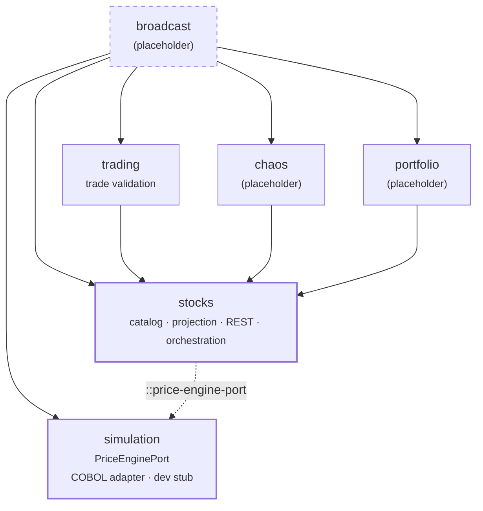
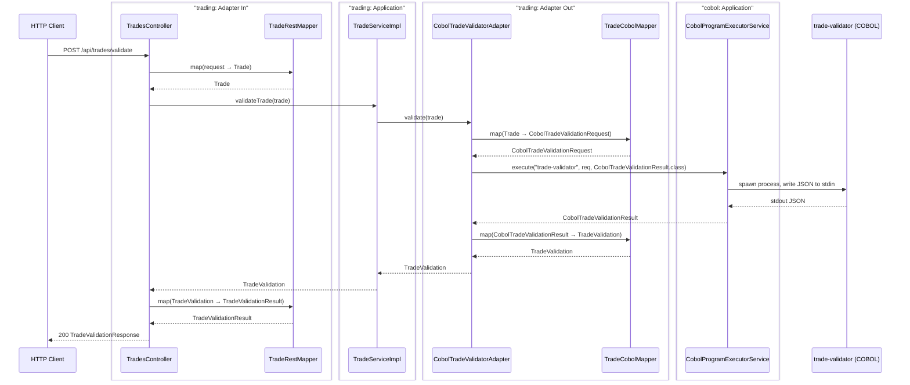
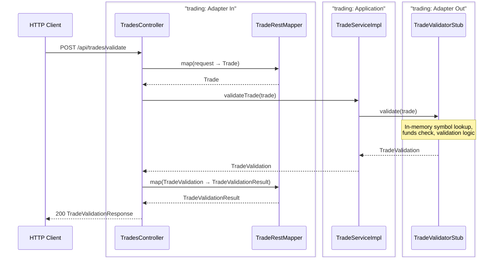
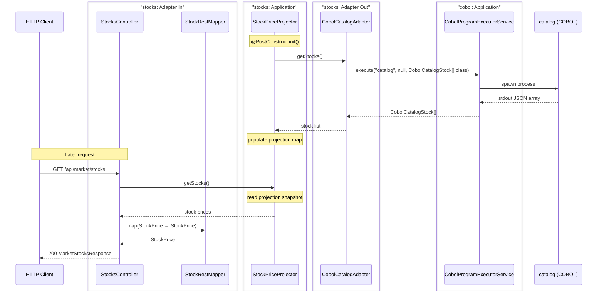
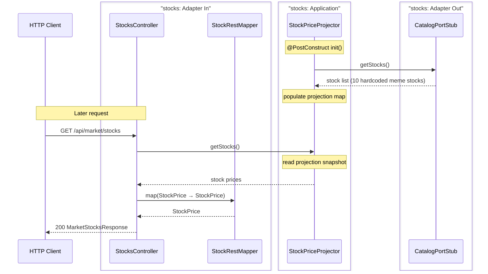
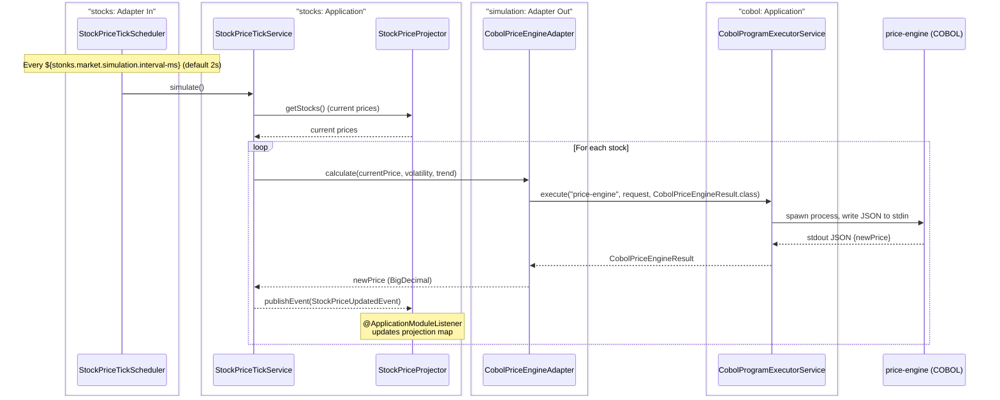
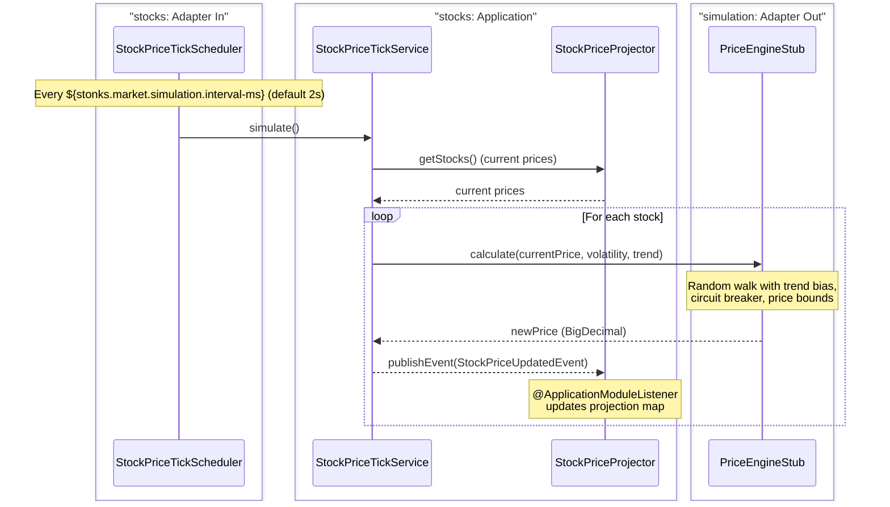

# stonks_java — Spring Boot Backend

Orchestrates the stonks-simulator: exposes REST APIs, runs the market simulation loop, and bridges requests to COBOL programs via **stdin/stdout JSON over OS process execution**.

---

## Module Architecture

---

## Happy Paths

### 1. Trade Validation

#### Real Scenario (COBOL)

#### Dev Stub Scenario (no COBOL)

---

### 2. Get Market Stocks

#### Real Scenario (COBOL catalog load at startup, then projection-based reads)

#### Dev Stub Scenario (no COBOL)

---

### 3. Price Simulation (Scheduled, Event-Driven)

The `StockPriceTickService` (in `stocks`) orchestrates each tick: it reads current prices and the stock catalog, delegates to `PriceEnginePort` (implemented by `simulation`), and publishes `StockPriceUpdatedEvent`. The `StockPriceProjector` (also in `stocks`) listens for those events and updates its projection.

#### Real Scenario (COBOL)

#### Dev Stub Scenario (no COBOL)

