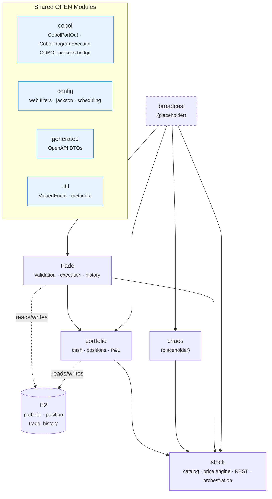
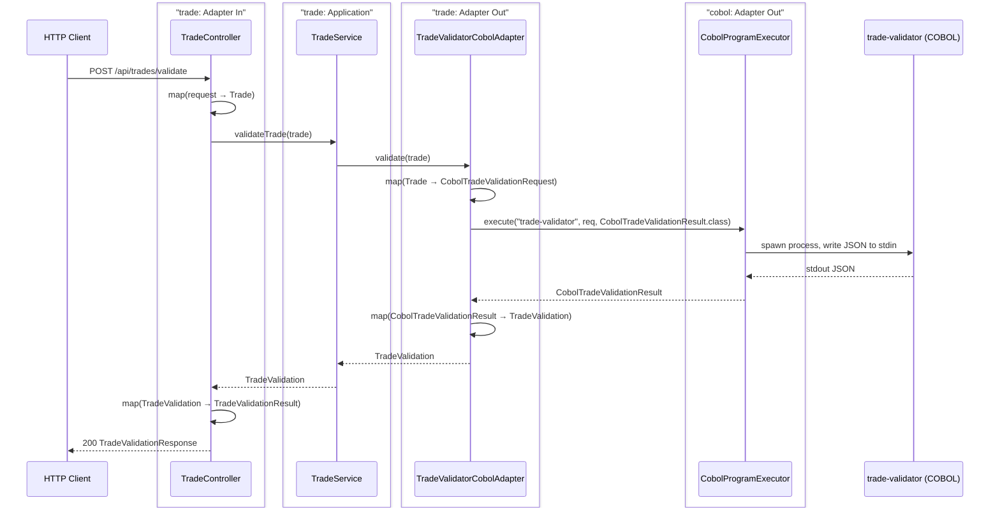
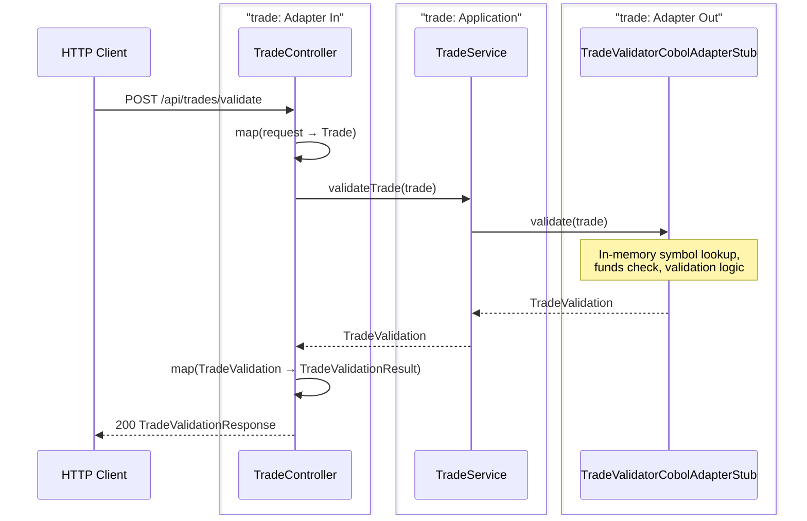
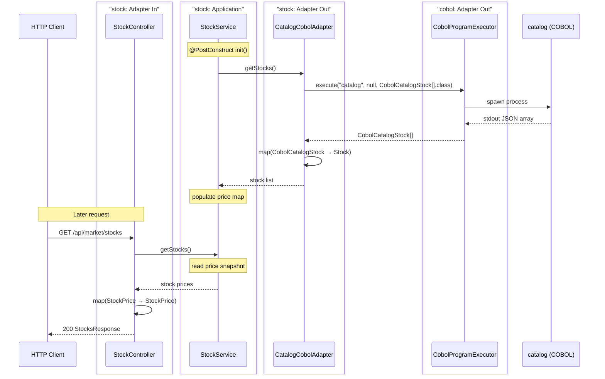
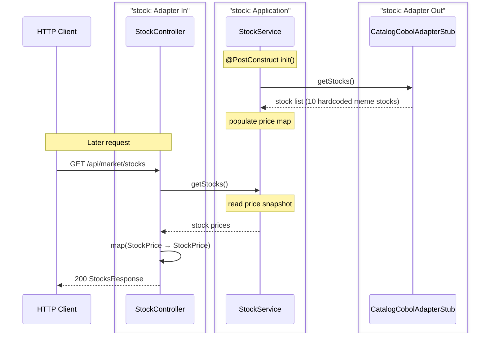
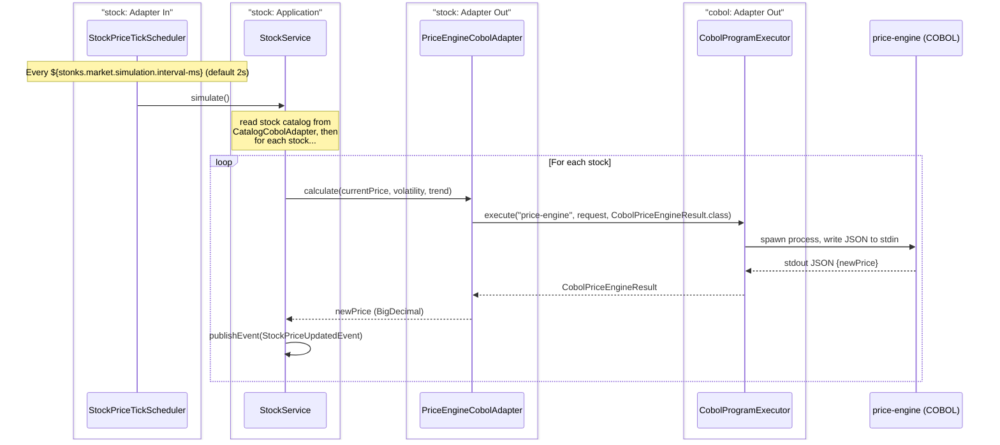
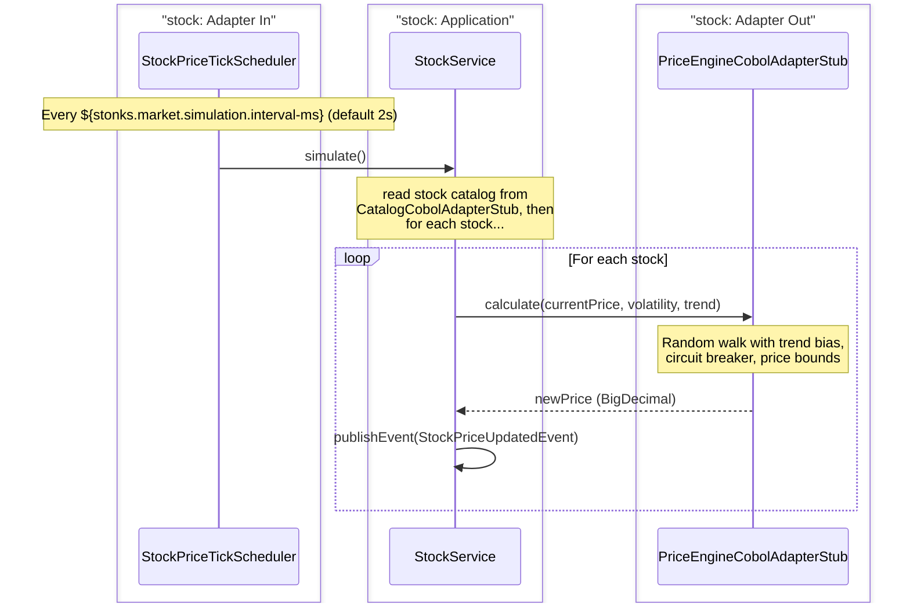
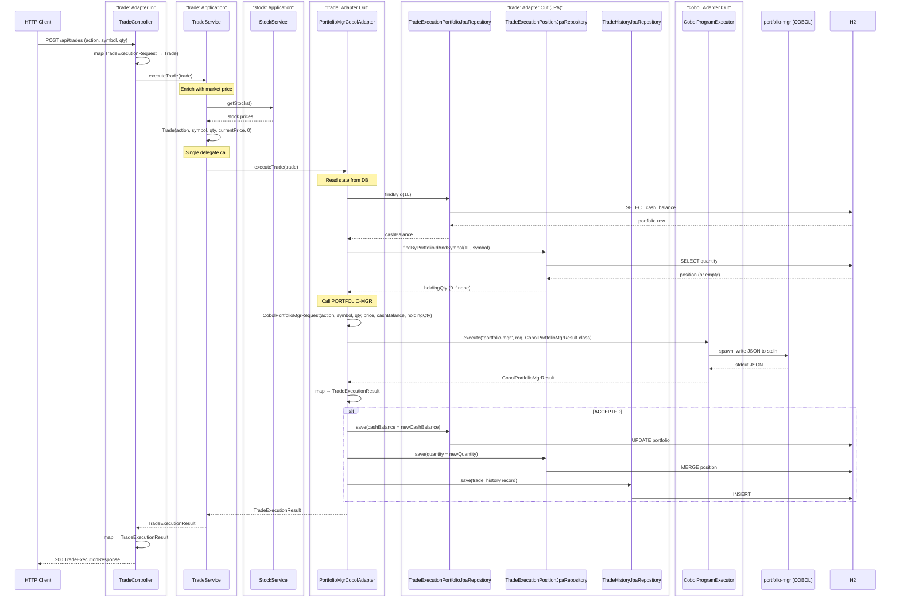
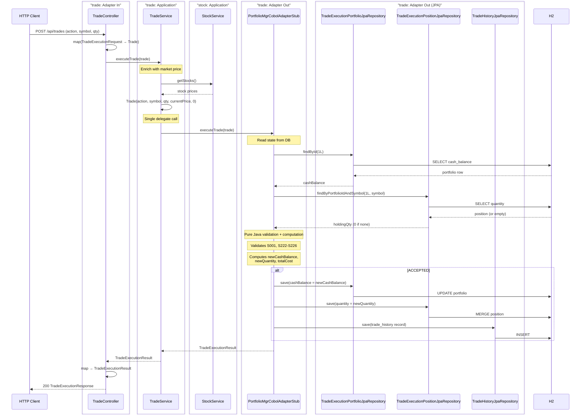
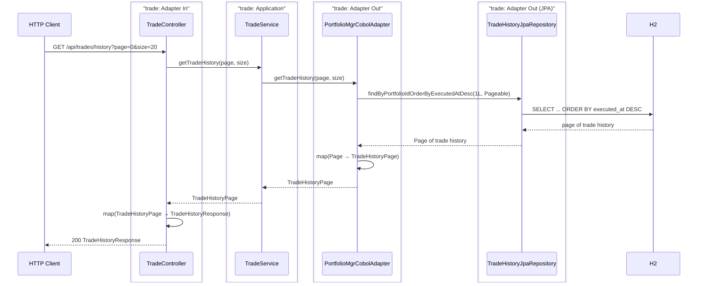

# stonks_java — Spring Boot Backend

Orchestrates the stonks-simulator: exposes REST APIs, runs the market simulation loop, and bridges requests to COBOL programs via **stdin/stdout JSON over OS process execution**.

## Environments

Three runtime profiles control which dependencies are active:

| Profile | DB | COBOL | OTel | Use case |
|---------|----|-------|------|----------|
| *(none)* | H2 (embedded) | Stubs (Java in-memory) | Disabled | Default for local dev & `./gradlew test` |
| `cobol` | H2 (embedded) | Real COBOL process execution | Disabled | Manual testing with COBOL setup |
| `production` | PostgreSQL | Real COBOL process execution | Enabled | Production/staging (*PG driver not yet in build.gradle*) |

- **`./gradlew bootRun`** — starts with H2 + stubs, no external dependencies needed.
- **`./gradlew bootRun --spring.profiles.active=cobol`** — starts with H2 + real COBOL binaries.
- **`./gradlew test`** — runs against H2 + stubs. CI-ready, zero config.
- **VS Code** — three launch configs in `.vscode/launch.json`: `[local]`, `[cobol]`, `[production]`.

### How it works

- `application.yaml` (always loaded) provides H2 datasource + disables OTel by default.
- COBOL stub adapters are annotated with `@Profile("!cobol & !production")` — active in any profile except `cobol` or `production`.
- Real COBOL adapters are annotated with `@Profile({"cobol", "production"})` — only active when one of those profiles is set.
- `application-production.yaml` overrides the datasource to PostgreSQL and enables OTel.

---

## Module Architecture



---

## Naming Convention

All classes follow the formula: `{Module}{Concept}{Layer}[Technology]`

| Part | Meaning | Examples |
|------|---------|----------|
| `Module` | Spring Modulith module the class belongs to | `Stock`, `Trade`, `Portfolio` |
| `Concept` | What the class does (omit when unambiguous) | `Catalog`, `PriceEngine`, `Validator`, `History` |
| `Layer` | Hexagonal/architectural role | `PortIn`, `PortOut`, `Controller`, `Service`, `Adapter`, `Mapper`, `Repository` |
| `[Technology]` | Implementation detail (optional) | `Cobol`, `Jpa`, `Rest` |

**Ports** — interfaces defining module boundaries:
`StockPortIn`, `StockPriceEnginePortOut`, `TradeValidatorPortOutCobol`, `PortfolioPortOut`

**Adapters** — technology-specific implementations of ports:
`StockCatalogCobolAdapter`, `StockPriceEngineCobolAdapterStub`, `TradeHistoryJpaAdapter`, `PortfolioJpaAdapter`

**Repositories & Mappers** — persistence and mapping layer:
`PortfolioPositionJpaRepository`, `TradePortfolioJpaRepository`, `TradeValidatorCobolMapper`

**Controllers & Services** — REST endpoints and application logic:
`StockController`, `TradeService`, `PortfolioService`

---

## Happy Paths

### 1. Trade Validation

#### Real Scenario (COBOL)



#### Dev Stub Scenario (no COBOL)



---

### 2. Get Market Stocks

#### Real Scenario (COBOL catalog load at startup, then projection-based reads)



#### Dev Stub Scenario (no COBOL)



---

### 3. Price Simulation (Scheduled, Event-Driven)

The `StockService` (in `stock`) orchestrates each tick: it reads the stock catalog, delegates to `PriceEnginePortOut` (implemented by `PriceEngineCobolAdapter`), and publishes `StockPriceUpdatedEvent`. Price tracking is handled in-memory within `StockService`.

#### Real Scenario (COBOL)



#### Dev Stub Scenario (no COBOL)



---

### 4. Trade Execution

`POST /api/trades` executes a BUY/SELL trade atomically:
1. Service enriches the request with the current market price via `StockPortIn`
2. Adapter reads portfolio cash balance and position holding qty from the DB
3. Adapter calls COBOL `PORTFOLIO-MGR` (which validates and computes new state)
4. If `ACCEPTED`, adapter persists updated cash balance, position, and trade history
5. Returns `TradeExecutionResult` with the new portfolio state

#### Real Scenario (COBOL)



#### Dev Stub Scenario (no COBOL)



---

### 5. Get Portfolio

`GET /api/portfolio` reads the portfolio + positions from the DB, fetches current stock prices from the `stock` module, and computes unrealized P&L per position and total.

#### Real & Dev Stub (no COBOL involved — pure DB + stock module)


---

### 6. Get Trade History

`GET /api/trades/history` returns paginated trade history from the DB via the outbound adapter.



---

## Hexagonal Architecture: Pragmatic Modulith Approach

### Core rule

The application core (`application/`) imports only:
- **Domain records** (`domain/`) — plain Java, zero framework coupling
- **Port interfaces** (`application/port/in/`, `application/port/out/`) — contracts, not implementations

Everything else (JPA entities, repositories, REST serialization, COBOL process bridges, MapStruct mappers) lives in the **adapter layer** (`adapter/in/`, `adapter/out/`). The core never sees infrastructure types.

### Why this shape

This is a **modulith** — a single deployable with strict module boundaries. Not microservices. The architecture optimizes for:

| Concern | Choice | Why |
|---------|--------|-----|
| Transaction boundary | `@Transactional` on the **service** (not the adapter) | The unit of work is a business operation (update portfolio + position + history atomically), not an infrastructure detail. Adapters participate via propagation. |
| Port granularity | Consolidate related CRUD behind one port | Avoid "one port per table" syndrome. `TradePortfolioStatePortOut` covers read + write of portfolio + position because they always change together. |
| Entity relationships | Adapters own entity lifecycle internally | The `TradeHistory` → `Portfolio` FK is resolved inside the adapter, not the core. Hibernate's first-level cache prevents redundant queries within the same transaction. |
| Profile segregation | Stub adapters active by default (`!cobol & !production`) | Local dev and CI need zero external dependencies. Real adapters activate only when the environment provides them. |

### Where we relaxed purity

A purist hexagonal architecture demands **one port per driven concern** and forbids any framework annotation in the core. We relaxed both in measured ways:

1. **`@Transactional` on the service** — purists would push this into an adapter or use a decorator. We keep it on the service because it marks a *business transaction boundary*, not a technical one. Every adapter call inside that method joins the same transaction via Spring's `TransactionManager` propagation.

2. **`Page`/`Pageable` in ports** — Spring Data's pagination types leak into the core. A purist would define a custom pagination domain object. We accepted the leak because:
   - Replacing `Page<TradeHistoryItem>` with a custom `Page<TradeHistoryItem>` adds zero semantic value
   - Every REST adapter would immediately map back to `Page` anyway
   - The dependency is on the **interface** (`org.springframework.data.domain.Page`), not on a specific implementation or data access technology

3. **Consolidated ports instead of fine-grained ones** — `TradePortfolioStatePortOut` combines read (`getState`) and write (`applyExecution`) for two entities (portfolio + position). A purist might split into four ports (read portfolio, write portfolio, read position, write position). We consolidated because:
   - These four operations always happen together in this module
   - The transaction boundary is the same
   - Fewer ports = less indirection = easier to reason about the modulith

### What ended up in the adapter layer

```
┌──────────────────────────────────────────────────────────┐
│         APPLICATION CORE (zero infra imports)            │
│                                                          │
│  TradeService                                           │
│    • TradePortIn                       (self)           │
│    • TradeValidatorPortOutCobol        (port)           │
│    • TradeExecutorPortOutCobol         (port)           │
│    • TradePortfolioStatePortOut        (port)           │
│    • TradeHistoryPortOutJpa            (port)           │
│    • StockPortIn                       (port)           │
│    • domain records only                                │
└──────────────────────┬───────────────────────────────────┘
                       │ depends on interfaces, never on classes
                       ▼
┌──────────────────────────────────────────────────────────┐
│  ADAPTERS (out) — own all infrastructure dependencies   │
│                                                          │
│  TradePortfolioStateJpaAdapter                           │
│    • TradePortfolioJpaRepository   (.generated.entity)   │
│    • TradePositionJpaRepository    (.generated.entity)   │
│                                                          │
│  TradeHistoryJpaAdapter                                  │
│    • TradeHistoryJpaRepository     (.generated.entity)   │
│    • TradeExecutionEntityMapper    (MapStruct)           │
│    • TradeHistoryJpaMapper          (MapStruct)          │
│                                                          │
│  TradeValidatorCobolAdapter / Stub                       │
│  TradePortfolioMgrCobolAdapter / Stub                    │
│    • CobolPortOut                  (.cobol module)       │
│    • Cobol DTOs + Cobol mappers                          │
└──────────────────────────────────────────────────────────┘
```
