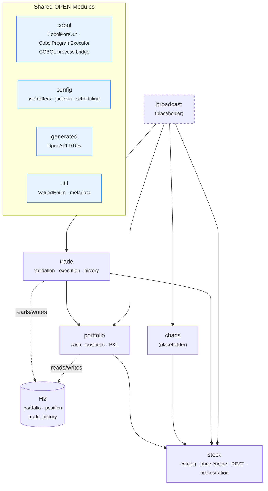
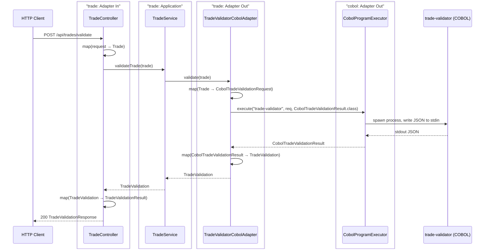
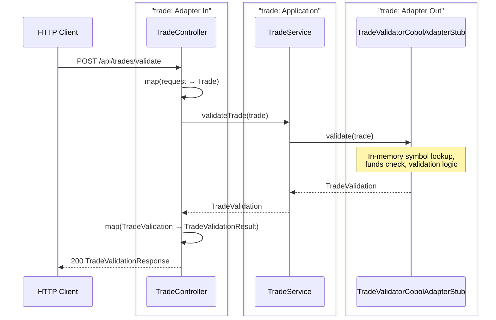
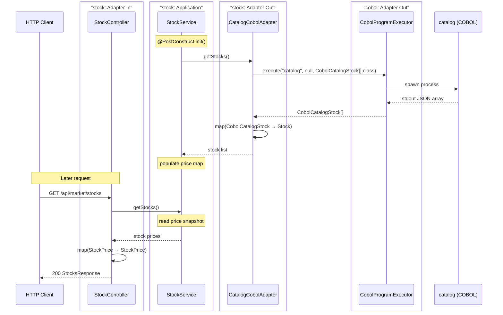
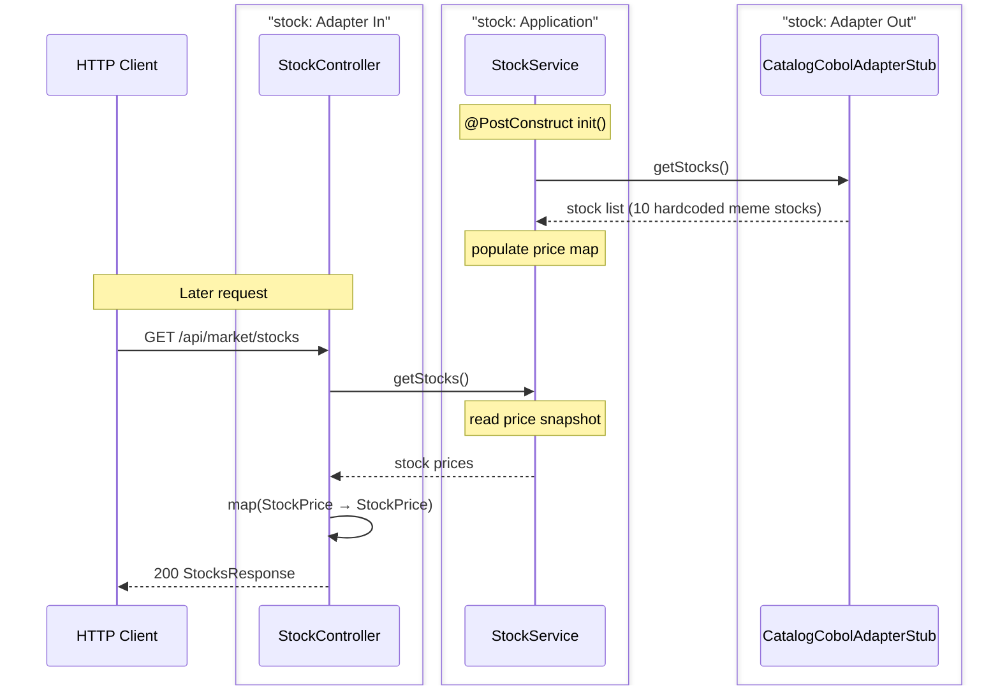
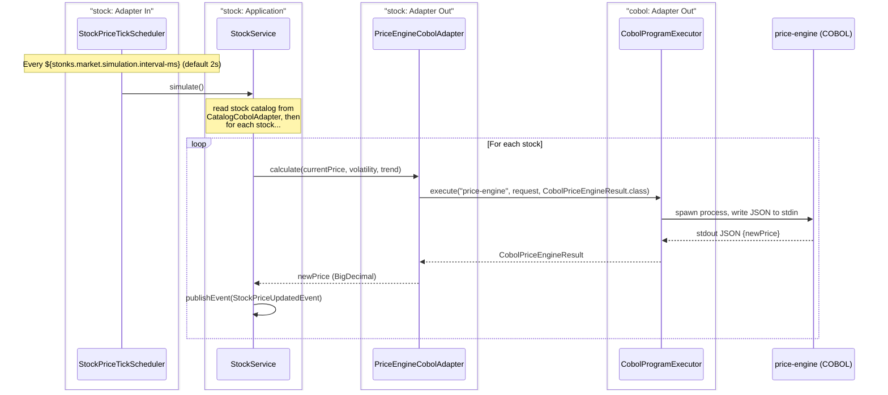
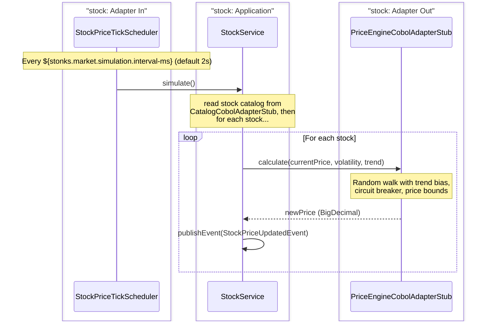
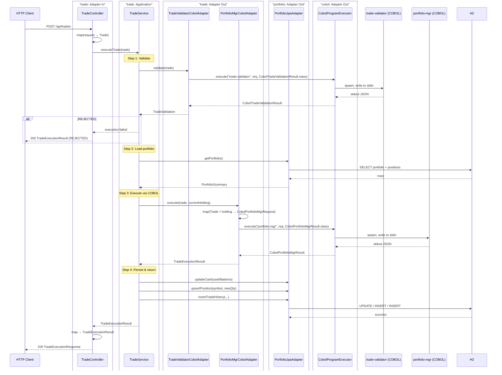
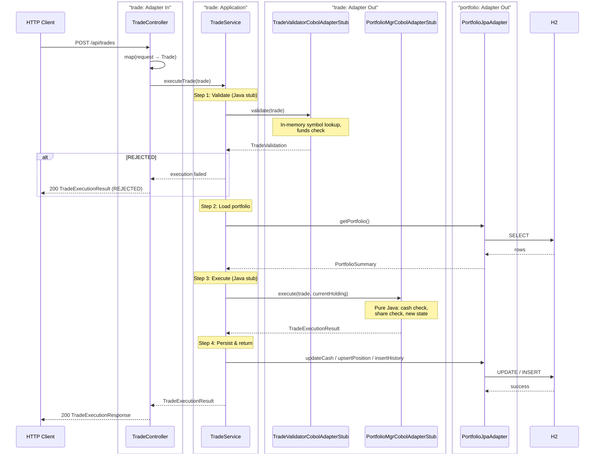
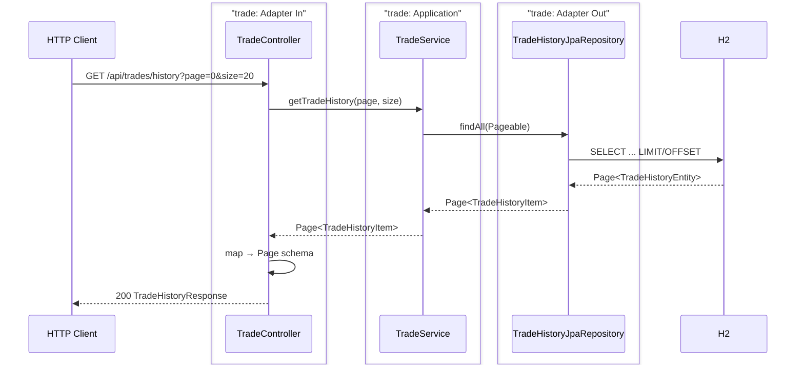

# stonks_java — Spring Boot Backend

Orchestrates the stonks-simulator: exposes REST APIs, runs the market simulation loop, and bridges requests to COBOL programs via **stdin/stdout JSON over OS process execution**.

---

## Module Architecture

---

## Happy Paths

### 1. Trade Validation

#### Real Scenario (COBOL)

#### Dev Stub Scenario (no COBOL)

---

### 2. Get Market Stocks

#### Real Scenario (COBOL catalog load at startup, then projection-based reads)

#### Dev Stub Scenario (no COBOL)

---

### 3. Price Simulation (Scheduled, Event-Driven)

The `StockService` (in `stock`) orchestrates each tick: it reads the stock catalog, delegates to `PriceEnginePortOut` (implemented by `PriceEngineCobolAdapter`), and publishes `StockPriceUpdatedEvent`. Price tracking is handled in-memory within `StockService`.

#### Real Scenario (COBOL)

#### Dev Stub Scenario (no COBOL)

---

### 4. Trade Execution

`POST /api/trades` validates the trade (reuses the validation flow), loads the current portfolio from the DB, delegates portfolio mutation to `PORTFOLIO-MGR` (COBOL), then persists the updated state inside a DB transaction.

#### Real Scenario (COBOL)

#### Dev Stub Scenario (no COBOL)

---

### 5. Get Portfolio

`GET /api/portfolio` reads the portfolio + positions from the DB, fetches current stock prices from the `stock` module, and computes unrealized P&L per position and total.

#### Real & Dev Stub (no COBOL involved — pure DB + stock module)

---

### 6. Get Trade History

`GET /api/trades/history` returns paginated trade history from the DB.

